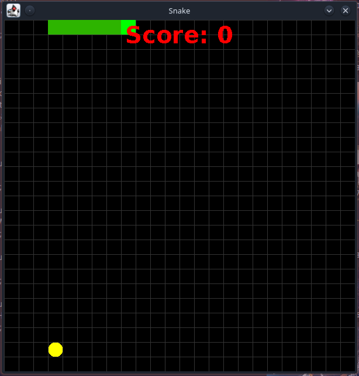

<h1 align="center">Snake Oyunu(JAVA)</h1>

 

  <strong>Java ile hazirlanmis Snake Oyunu</strong>
   
  
  
  
  

 

# Bilgiler
Javax ile hazirlanmis Snake Oyunu. Egitim amacli hazirlanmistir.

## Temel Gereksinimler:

1- Java IDE (NetBeans kullandim bu Projede)

2- JDK

### Projeyi calistirma ve inceleme:

Projeyi calistirmak icin : Jar dosyasini indirebilirsiniz.

### PR:
Bug yada hata bulmaniz durumunda PR kabul edilir. Simdiden tesekkür ederim :)
